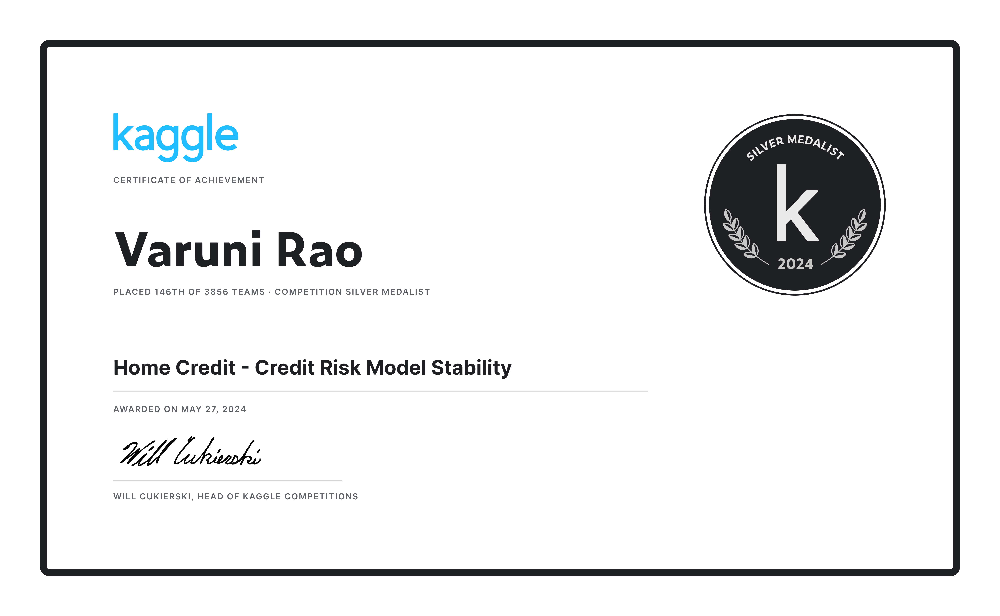

# Home Credit – Credit Risk Model Stability

**Kaggle Silver Medal — Rank 147 / 3,856 (Top 4%)**
<div align = "left"></div>

Code and experiments for the [Home Credit – Credit Risk Model Stability](https://www.kaggle.com/competitions/home-credit-credit-risk-model-stability) competition.

## Competition

Predict loan default risk with a focus on **model stability over time**. The evaluation uses a Gini stability metric that penalizes performance degradation across future weeks and rewards consistent predictions — a realistic proxy for production drift in credit scoring.

## Result

- **Private LB Rank:** 147th of 3,856 teams
- **Medal:** Silver
- **Winning submission:** LightAutoML CV5 ensemble (`src/train_lightautoml.py`)
  - Other approaches (LightGBM unbalanced, H2O AutoML) were developed for experimentation and diversity but the LightAutoML pipeline achieved the final silver score.

## Repository Structure

```
home-credit-risk-stability-silver/
├── README.md
├── LICENSE
├── requirements.txt
├── .gitignore
├── src/
│   ├── utils.py                     # shared functions
│   ├── data_prep.py                 # data aggregation pipeline
│   ├── train_lightautoml.py         # ★ silver-medal model (LightAutoML CV5)
│   └── inference_lightautoml.py
├── experiments/
│   ├── train_h2o.py                 # experimental (H2O AutoML)
│   ├── inference_h2o.py
│   ├── train_lgbm.py                # experimental (LightGBM unbalanced ensemble)
│   └── inference_lgbm.py
└── notebooks/
    ├── 00_utils.ipynb              
    ├── 01_data_prep.ipynb
    ├── 02_lgbm_unbalanced_ensemble.ipynb
    ├── 03_lgbm_inference.ipynb
    ├── 04_lightautoml_cv5.ipynb
    ├── 05_lightautoml_single.ipynb
    ├── 06_lightautoml_inference.ipynb
    ├── 07_h2o_automl_train.ipynb
    └── 08_h2o_automl_submit.ipynb
```

## Key Components

### `src/utils.py`
Central utility module converted from `homecreditutility-v5.ipynb`. It provides:
- Memory-efficient parquet loading with Polars/pandas
- Aggregation helpers for auxiliary tables (bureau, previous, installments)
- Time-based validation split by `WEEK_NUM`
- Feature downcasting and categorical handling
- Common evaluation function for stability metric

All training scripts import from `utils.py` to ensure consistent preprocessing — critical for stability.

## Primary Approach: LightAutoML

The silver-medal solution is a **time-aware LightAutoML pipeline**:

- **File:** `notebooks/04_lightautoml_cv5.ipynb` → `src/train_lightautoml.py`
- **Validation:** 5-fold split by `WEEK_NUM` to mimic the Gini stability metric
- **Features:** aggregated features from `utils.py` (bureau, previous applications, installments)
- **Why it worked:** LightAutoML's automatic feature selection combined with week-based CV reduced variance across time periods, directly optimizing for stability rather than peak AUC.

## Other Approaches

1. **LightGBM Unbalanced Ensemble** (`train_lgbm.py`)
   - Uses utils for time-aware splits
   - Class imbalance handling via custom sampling
   - Ensemble of folds

2. **H2O AutoML** (`train_h2o.py`)
   - Diversity model trained on same features from utils

## Installation

```bash
git clone https://github.com/<your-username>/home-credit-risk-stability-silver.git
cd home-credit-risk-stability-silver
pip install -r requirements.txt
```
## Reproduce Silver Submission

1. Download competition data to `data/` (not tracked)
2. Run the following bash commands
    ```bash
    python src/data_prep.py
    python src/train_lightautoml.py
    python src/inference_lightautoml.py
    ```
3. Inference scripts generate submissions

Notebooks are stored with outputs cleared. For rendered versions, see the Kaggle discussion or run locally.

## Certificate

The official Kaggle silver medal certificate is stored in `assets/kaggle-silver-certificate.png` and displayed at the top of this README.

## License

MIT — see LICENSE file
